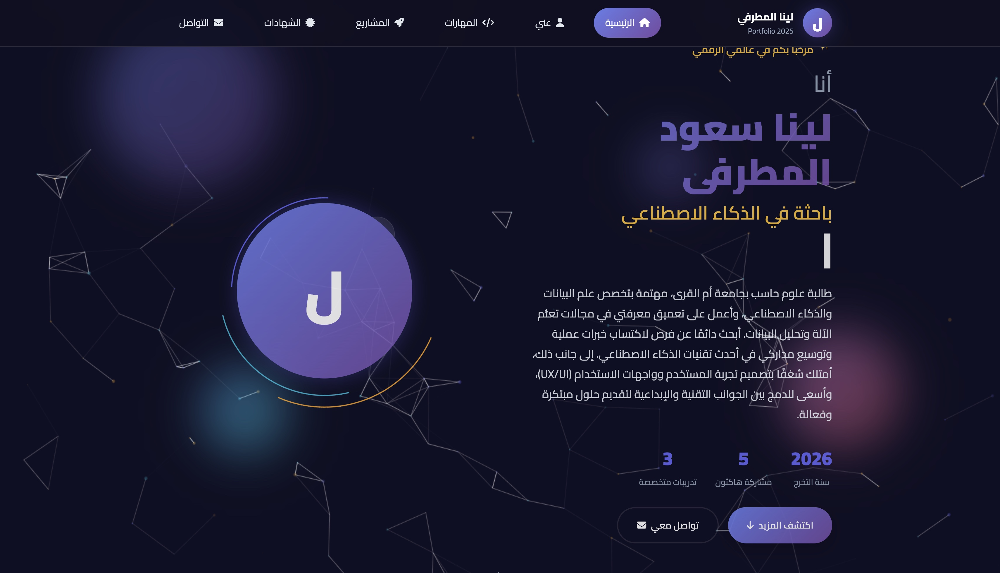
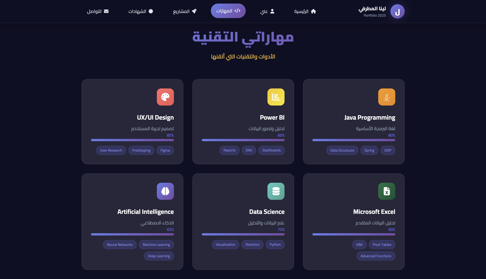
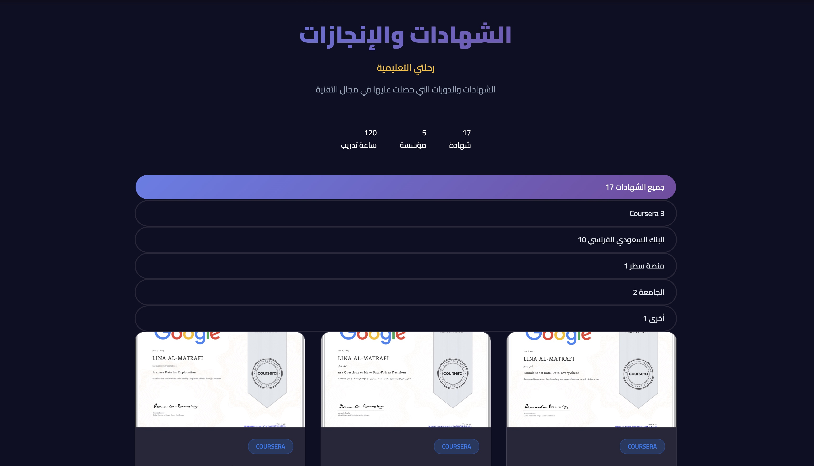
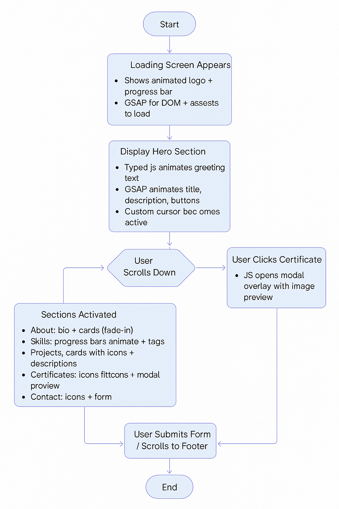

#  Lina Almutrafi – Personal Portfolio Website (2025)

A modern, responsive, and fully animated personal portfolio website designed and developed using **HTML**, **CSS**, and **JavaScript**. This project serves as a digital résumé and showcase for my skills, certifications, projects, and contact information — all styled with attention to detail, animations, and interactivity.

---

## 1.  Project Description 🧠 :

This personal portfolio aims to professionally present my background in **Computer Science**, with a focus on:

- **Data Science**
- **Artificial Intelligence**
- **Front-End Development**
- **UX/UI Design**

The website is fully client-side, built from scratch without frameworks, and includes responsive design, animated sections, interactive modals, and a contact form.

---

## 2.  Tools & Technologies Used 🛠️ :

| Tool/Library             | Purpose                                |
|--------------------------|----------------------------------------|
| **HTML5**                | Structure and semantic layout          |
| **CSS3**                 | Styling with custom variables, grid, responsive layout |
| **JavaScript (ES6)**     | Interactivity, DOM manipulation, event handling |
| **GSAP**                 | Smooth animations and transitions      |
| **ScrollTrigger**        | Animations triggered by scroll         |
| **Typed.js**             | Typing effect in the hero section      |
| **AOS**                  | Scroll-based animation library         |
| **Particles.js**         | Particle effects in the hero and loading screen |
| **Font Awesome**         | Icons throughout the interface         |

---

## 3.  Project Structure 📂 :
 portfolio-website 📦/
├── index.html
├── styles.css
├── script.js
├── images/
│ ├── BSF.jpeg
│ ├── Courser.jpeg
│ ├── Sater.jpeg
│ ├── Hakthon.jpeg
│ ├── UQU.jpeg
│ └── Other.jpeg
├── Pdf/
│ ├── BSF.pdf
│ ├── Coursera.pdf
│ ├── Sater.pdf
│ ├── Hakthon.pdf
│ ├── Uqu.pdf
│ └── Other.pdf
└── README.md

نسخ
تحرير
---

## 4.  Key Features 🎨:

- ✅ Fully responsive layout (mobile, tablet, desktop)
- ✅ Glassmorphism UI and modern visual design
- ✅ Animated hero section with custom avatar
- ✅ Interactive soft/technical skills section
- ✅ Certificates with filter and preview modal (PDF & images)
- ✅ Typing animation using Typed.js
- ✅ Scroll-triggered animations via AOS and GSAP
- ✅ Custom cursor and dynamic scroll behavior
- ✅ Contact form with validation and alerts

---

## 5.  Screenshots 📸 : 

| Hero Section | Skills Section | Certificate Modal |
|--------------|----------------|-------------------|
|  |  |  |

---

## 6.  Flowchart - Website 🧭 :

This chart illustrates the interactive behavior and structure of the website:

### 🔄 Step-by-Step Breakdown

1. **Start**  
   User opens the site (`index.html`).

2. **Loading Screen Appears**  
   - Displays animated logo and progress bar  
   - Uses GSAP to wait for all DOM & assets to load

3. **Display Hero Section**  
   - Typed.js animates intro text  
   - GSAP reveals headings, description, and buttons  
   - Custom cursor becomes active

4. **User Scrolls Down**  
   - Triggers the appearance of each section (via AOS.js)  
   - Sticky navigation is activated

5. **Sections Activated**  
   - **About:** Personal intro and goals  
   - **Skills:** Progress bars and tags  
   - **Projects:** Animated cards with descriptions  
   - **Certificates:** Filterable cards + modal preview  
   - **Contact:** Icons and form

6. **User Clicks Certificate**  
   - Modal popup opens showing certificate image

7. **User Submits Form or Reaches Footer**  
   - Form and contact details are displayed

8. **End**  
   - Smooth experience concludes

---

###  Flowchart Diagram 🖼️ :

 

