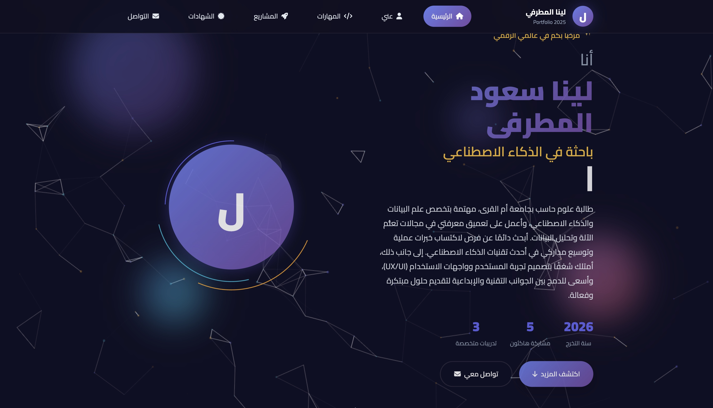
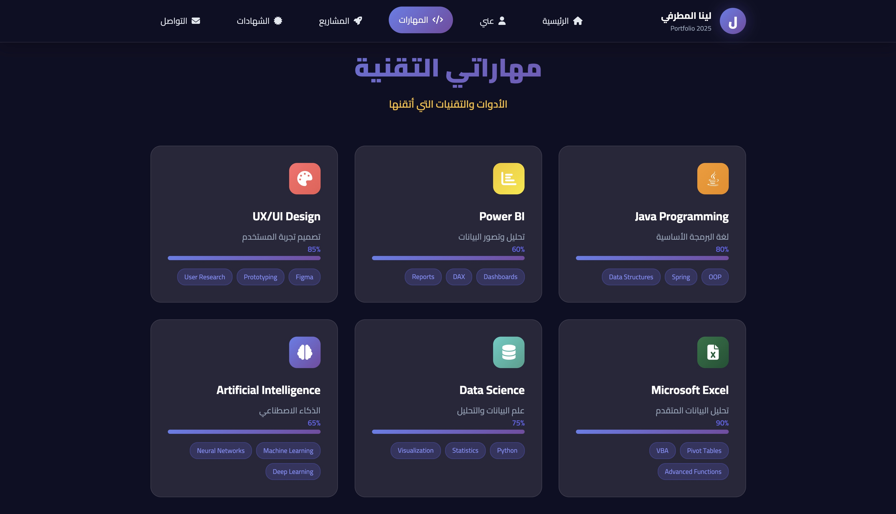
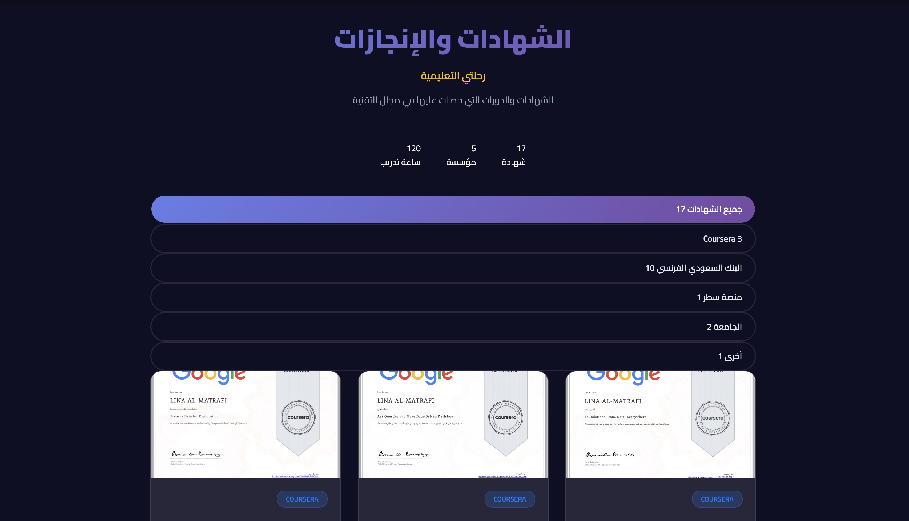
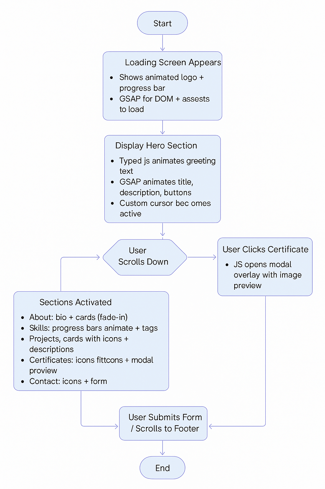

#  Lina Almatrafi – Personal Portfolio Website :


A modern, responsive, and fully animated personal portfolio website designed and developed using **HTML**, **CSS**, and **JavaScript**. This project serves as a digital résumé and showcase for my skills, certifications, projects, and contact information — all styled with attention to detail, animations, and interactivity.

---

## 1.  Project Description 🧠 :

This personal portfolio aims to professionally present my background in **Computer Science**, with a focus on:

- **Data Science**
- **Artificial Intelligence**
- **Front-End Development**
- **UX/UI Design**

The website is fully client-side, built from scratch without frameworks, and includes responsive design, animated sections, interactive modals, and a contact form.

---

## 2.  Tools & Technologies Used 🛠️ :

| Tool/Library             | Purpose                                |
|--------------------------|----------------------------------------|
| **HTML5**                | Structure and semantic layout          |
| **CSS3**                 | Styling with custom variables, grid, responsive layout |
| **JavaScript (ES6)**     | Interactivity, DOM manipulation, event handling |
| **GSAP**                 | Smooth animations and transitions      |
| **ScrollTrigger**        | Animations triggered by scroll         |
| **Typed.js**             | Typing effect in the hero section      |
| **AOS**                  | Scroll-based animation library         |
| **Particles.js**         | Particle effects in the hero and loading screen |
| **Font Awesome**         | Icons throughout the interface         |

---

## 3.  Project Structure 📂 :

 ```text
 
portfolio-website📦/
├── index.html
├── styles.css
├── script.js
├── images/
│ ├── BSF.jpeg
│ ├── Courser.jpeg
│ ├── Sater.jpeg
│ ├── Hakthon.jpeg
│ ├── UQU.jpeg
│ └── Other.jpeg
├── Pdf/
│ ├── BSF.pdf
│ ├── Coursera.pdf
│ ├── Sater.pdf
│ ├── Hakthon.pdf
│ ├── UQU.pdf
│ └── Other.pdf
└── README.md
 ```
---

## 4.  Key Features 🎨:

- ✅ Fully responsive layout (mobile, tablet, desktop)
- ✅ Glassmorphism UI and modern visual design
- ✅ Animated hero section with custom avatar
- ✅ Interactive soft/technical skills section
- ✅ Certificates with filter and preview modal (PDF & images)
- ✅ Typing animation using Typed.js
- ✅ Scroll-triggered animations via AOS and GSAP
- ✅ Custom cursor and dynamic scroll behavior
- ✅ Contact form with validation and alerts

---

## 5.  Screenshots 📸 : 


##  Screenshots🖼️

| Section          | Screenshot                              | Description                             |
|------------------|------------------------------------------|-----------------------------------------|
| Hero Section     |                   | Landing section with animated greeting and particles |
| Skills Section   |                    | Technical & soft skills with progress bars |
| Certificate Modal|               |       Modal preview for certificate images/PDF |
| Flowchart        |               | Visual flow of how the site operates    |


---

## 6.  Flowchart - Website 🧭 :

This chart illustrates the interactive behavior and structure of the website:

     


##  Step-by-Step Breakdown 🔄

This outlines the user flow and structure of the website:

1. **Start** – User opens the site (`index.html`)
2. **Loading Screen** – Animated logo and progress bar triggered via JS & GSAP
3. **Hero Section** – Animated greeting with Typed.js, GSAP transitions, and custom cursor
4. **Scrolling Down** – Triggers AOS scroll-based animations; sticky navigation bar activated
5. **Section Highlights** – Navigation through:
   - About
   - Skills
   - Projects
   - Certificates
   - Contact
6. **Click Certificate** – Modal popup displays certificate (PDF/image)
7. **Form Interaction** – Contact form appears; footer with additional info
8. **End** – Seamless finish of user journey


---

##  Included Assets 📂 

- PDF certificates (BSF, Coursera, UQU, etc.)
- Image previews for Coursera, Sater, and Hackathon events
- Personal avatar/logo 
- Animated particles background (using Particles.js)
- 🖼️ Coursera Certificates (Images):

- 

-  

- 


 - AI, Data Base, and more...

Each certificate is displayed in a filterable grid and opens in a preview modal when clicked.


---

## 9.  Future Enhancements 📈 :

-  Deploy with custom domain (e.g., lina.dev) 🌐
-  Backend integration for contact form (EmailJS / Firebase) 📩
-  Light/Dark mode toggle 🎨
-  Allow download of résumé/CV PDF 💾
-  Add blog or article publishing section 📝


----

## 10.  About the Author 👩‍💼:

**Lina Saud Almatrafi**  
📍 Makkah, Saudi Arabia  
🎓 B.Sc. in Computer Science – Umm Al-Qura University  
🎯 Passionate about Data Science, AI, UX/UI, and creative front-end design.

📧 Email: linasaud@outlook.sa  
📱 Phone: --

---


##  Challenges I Faced 🧱

- Managing multiple animation libraries (GSAP, AOS, Typed.js, Particles.js)
- Building a fully responsive and synced loading screen
- Creating a custom dual-layer animated cursor
- Balancing smooth animations with page performance
- Implementing certificate filtering using vanilla JS
- Designing modal popups to preview certificates
- Ensuring responsive design across devices and browsers
- Managing right-to-left (RTL) layout compatibility with animations
- Handling animation timing and scroll-trigger issues
- Keeping code modular, clean, and maintainable

---

##  Solutions & Improvements ✅

- Used Chrome DevTools and JS console for debugging
- Modularized code with clear comments and CSS custom properties
- Consulted official docs (GSAP, AOS, Typed.js) for best practices
- Tested performance and animations across multiple screen sizes
- Compressed image sizes and optimized animation rendering
---
